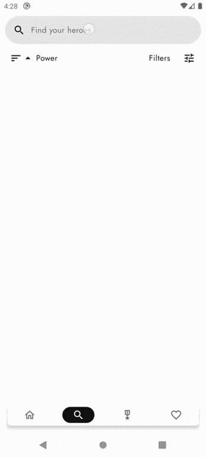

<h1 align="center">Soreh</h1>

  
Soreh is a simple compose demo app based on modern Android application tech-stacks and CLEAN architecture. 
In Soreh app you can find superheroes and villains from different publishers and their statistics.

 

&nbsp;&nbsp;&nbsp;&nbsp;&nbsp;&nbsp;
&nbsp;&nbsp;&nbsp;&nbsp;&nbsp;&nbsp;

&nbsp;&nbsp;&nbsp;&nbsp;&nbsp;&nbsp;
&nbsp;&nbsp;&nbsp;&nbsp;&nbsp;&nbsp;  

## Features

- Four screens
  - Main - A carousel showing 10 random characters
  - Search - A screen to search by name, with filters and different sorting criteria (FlowRow and Material3 components: SearchBar, BottomSheetScaffold, FilterChip, RangeSlider, ExposedDropdownMenuBox, ExposedDropdownMenu, DropdownMenuItem)
  - Tops - The top 10 of the most complete characters of some of the most important publishers/universes
  - Favorites - A screen to save your favorite characters
- Splash screen that remains until the worker completes the network caching
- [Single source of truth (Room)](https://developer.android.com/jetpack/guide/data-layer#source-of-truth)
- [Unidirectional Data Flow](https://developer.android.com/jetpack/guide/ui-layer#udf)
- [Error handling (Result<T>)](https://developer.android.com/jetpack/guide/data-layer#expose-errors)
- SnackbarHost - To show errors on the screen
- Offline mode
- [User events in ItemUIState](https://developer.android.com/jetpack/guide/ui-layer/events?continue=https%3A%2F%2Fdeveloper.android.com%2Fcourses%2Fpathways%2Fandroid-architecture%23article-https%3A%2F%2Fdeveloper.android.com%2Fjetpack%2Fguide%2Fui-layer%2Fevents#recyclerview-events)
- Day/Night theme
- Pager custom transitions
- Pager indicator custom transitions
- Dynamic background color - Based on the dominant colors of the character images.
- Implicit intents - To view or share the complete info of a character
- CLEAN Architecture - UI, Domain and Data layer ([google way](https://developer.android.com/topic/architecture#recommended-app-arch))
- Multi-module project. One module per CLEAN Architecture layer
- Unit Tests
  - Repository
  - ViewModel
- Integration tests with fake data sources.
- Instrumentation Tests with Hilt
  - End-to-end for "Search" feature
  - Worker

  ## Preview

  <H4 align="center">Pager Transition, Dynamic Background Color & Implicit Intent</H4>
  

  
  

    
  <H4 align="center">Pager & Pager Indicator Transition</H4>
  

  
  

    
  <H4 align="center">Search with Filters & Sorting Criteria</H4>
  

  
  

    
  <H4 align="center">Splash Screen & Carousel</H4>
  

  
  

    

## Tech stack & Open-source libraries
- Jetpack Compose - Android's modern toolkit for building native UI.
- [Splash Screen](https://developer.android.com/develop/ui/views/launch/splash-screen) - SplashScreen API lets apps launch with animation, including an into-app motion at launch, a splash screen showing your app icon, and a transition to your app itself.  
- ViewModel - State Holder. Responsible for the production of UI state, contains the necessary logic for that task.
- Lifecycle - Lifecycle-aware components.
- [Navigation Compose](https://developer.android.com/jetpack/compose/navigation) - The Navigation component provides support for Jetpack Compose applications. You can navigate between composables while taking advantage of the Navigation component’s infrastructure and features.
- [WorkManager](https://developer.android.com/jetpack/androidx/releases/work) - The WorkManager API makes it easy to schedule deferrable, asynchronous tasks that must be run reliably.
- Room - Database.
- Kotlin Coroutines - A concurrency design pattern to simplify code that executes asynchronously.
- Kotlin Flows - In coroutines, a flow is a type that can emit multiple values sequentially, as opposed to suspend functions that return only a single value. For example, you can use a flow to receive live updates from a database.
- [Dagger-Hilt](https://dagger.dev/hilt/gradle-setup) - Dependency injection.
- [Coil](https://github.com/coil-kt/coil) - An image loading library for Android backed by Kotlin Coroutines.
- [Retrofit2 & Moshi](https://github.com/square/retrofit) - REST API consumption.
- [MockWebServer](https://github.com/square/okhttp/tree/master/mockwebserver) - A scriptable web server for testing HTTP clients.
- [Timber](https://github.com/JakeWharton/timber) - A logger with a small, extensible API which provides utility on top of Android's normal Log class.
- [ComposeLoading](https://github.com/commandiron/ComposeLoading) - Loading spinners in Android Jetpack Compose.
- [Placeholder](https://google.github.io/accompanist/placeholder/) - A library which provides a modifier for display 'placeholder' UI while content is loading.
- [Compose Material Design 3 components](https://developer.android.com/jetpack/androidx/releases/compose-material3) - Modular and customizable Material Design UI components for Android.
- [Mockito](https://github.com/mockito/mockito-kotlin) - Mocking framework for unit tests.
- [Turbine](https://github.com/cashapp/turbine) - A small testing library for kotlinx.coroutines Flow.
- [Leakcanary](https://square.github.io/leakcanary/getting_started/) - A memory leak detection library.

## Architecture
<h3 align="center">CLEAN Architecture</h3>
 

  

  
<h3 align="center">MVVM Architecture & Repository Pattern</h3>
 

 

  
<h3 align="center">Network Caching</h3>
 

 

  

## API
The SuperHero API exposes SuperHeroes and Villians data from all universes under a single REST API.  
Soreh uses the SuperHero API. Get your API_KEY [SuperHeroAPI](https://superheroapi.com/) and paste it to the gradle.properties file to try the app.
